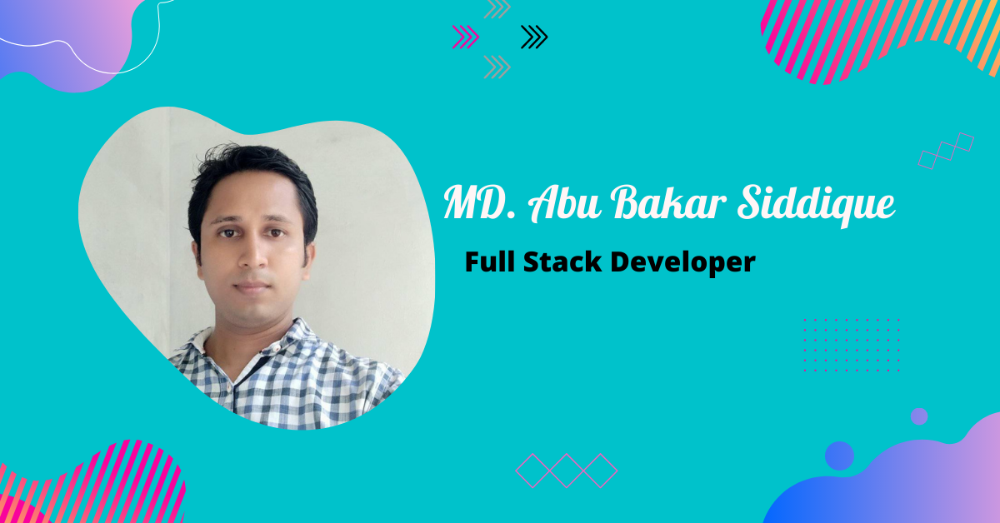

<!-- banner image starts here  -->

<!-- banner image ends here  -->

<h1> 👋 Hello, I'm MD. Abu Bakar Siddique </h1>

A full time Web design & Web developer  
🏠 &nbsp; Living: Dhaka, Bangladesh

 

 

<!-- Contact me section starts here  -->

[][facebook]
[][linkedin]
 
 

<!-- Contact me section ends here  -->

<!-- about-me section starts here  -->

### 👨‍🏫 &nbsp; About Me

  I am Md. Abu Bakar Siddique,Have completed B.Sc in Electronics and Communication Engineering(ECE) from Institute of Science & Technology(IST),Under National         University.I have experience on Web design & Web development. After completing my  B.Sc Engineering, I am spending much time
  improving my web development skills. Every day I want to learn something new and share my knowledge with
  my teachers and others.

 
<!-- about-me section ends here  -->

<!-- web related skills section starts here  -->

### 👨🏽‍💻 &nbsp; My Skills & Experiance:

#### Key Skills on Web design & Web development:

 
 
 

<!-- web related skills section ends here  -->
<!-- other skills and my videos for computer science section starts here  -->

#### Other Skills & Videos:

 
 
 

- CCNA
- LINUX
- MCSA
- MikroTik 
- Networking
- Operating System
- HSC ICT
- Learn for skill
- MS Word
- MS Excel
- MS powerpoint

  <!-- other skills and my videos for computer science section ends here  -->

   
  
   <!-- github stats starts here  -->

<!--  -->

 

<!-- github stats ends here  -->

<!-- other skills and my videos for computer science section starts here  -->

<!-- My project history starts here  -->

### 🖥 &nbsp; My project History
- Job site
- Invenrory Management With Pos
- Blog Project
- E-Commerce

<!--  My project history ends here  -->

 
<!-- work experience section starts here  -->

### 💼 &nbsp; Employment History

| Position            | Institute                                   | Duration            | Location           |
| ------------------- | ------------------------------------------- | ------------------- | ------------------ |
| Software Engineer        | Alpha Commerz Ltd. (php & laravel,Yii)      | July,2023 to October,2023 | Dhanmondi, Bangladesh  |
| Web Developer        | Classic It & Sky Mart Ltd. (php & laravel)      | December,2022 to May,2023 | Uttara, Bangladesh  |
| IT Executive        | Star Paradise Ltd. (Hardware and Network Engineer)      | December 2016 to June 2019 | Banani, Bangladesh  |
| IT Executive        | Cloud Systems Limited   (Hardware and Network Engineer) | May 2016 to November 2016   | Kuril Road, Bangladesh  |

 
<!-- Training /Courses section starts here  -->

### 💼 &nbsp; Training /Courses History

| Course Name                        | Topic                                   | Institute                       | Duration           |
| ---------------------------------- | ------------------------------------------- | --------------------------- | ------------------ |
| Web Development With PHP & Laravel | PHP & Laravel                               | Ostad(Gulshan-2), (Batch-2) | ongoing            |
| Web Development                    | PHP, MySQL, Laravel            | Belancer (under LICT project of BCC, ICT Division) | 60 hours  |
| Web design & Development        | HTML, CSS, Bootstrap, MySQL, PHP, JavaScript, jQuery     | CSL Training, Dhanmondi. | 84 hours  |
| LINUX   (RHCSA,RHCE) | Red Hat Linux System Administration and Engineer. |CSL Training, Dhanmondi.  | 60 hours  |
|CCNA        | Cisco Certified Network Associate. |CSL Training, Dhanmondi.  | 60 hours  |
| MCSA       | Microsoft Certified Solutions Associate. |CSL Training, Dhanmondi.  | 60 hours  |

 
<!-- work experience section ends here  -->
<!-- education section starts here  -->

### 👨🏻‍🎓 &nbsp; Education

1. B.Sc. in Electronics and Communication Engineering   
   Institute of Science & Technology, National University    
   Dhaka, Bangladesh.
2. H.S.C  (Science)  
   Government Syed Hatem Ali College   
   Barisal, Bangladesh.
3. S.S.C/Dakhil (Science)  
   Jhalokathi N.S Kamil Madrasah   
   Jhalokathi, Bangladesh.

 

<!-- education section ends here  -->

<!-- my languages section starts here  -->

### Languages:

- 🇧🇩 Bangla : Native
- 🏴󠁧󠁢󠁥󠁮󠁧󠁿 English : Advanced
- 🇮🇳 Hindi : Intermediate

   

<!-- my languages section ends here  -->

<!-- my sports and game section starts here  -->

### Sports / Game / Activities / Hobby:

- 🏏 Cricket, ⚽ Football, 🏸 Badminton, ♟️ Chess, 🏐 Volleyball
- 🏊‍♂️ Swimming, 🏃‍♂️ Running, 🚶‍♂️ Walking
- ✈️ Travelling

 
<!-- my sports and games section ends here  -->

<!-- Honors & awards section starts here  -->

## 📧 For Business Inquiries 
✅  ► niaz_ece2@gmail.com

---

Thanks for going through my Portfolio.
All rights reserved by MD. Abu Bakar Siddique @2022

---

<!-- my achievement section ends here  -->

<!-- Links section starts here -->

[facebook]: https://www.facebook.com/arif.islam.7921975/
[linkedin]: https://www.linkedin.com/in/md-abu-bakar-siddique-niaz-9833622a/
[github]: https://github.com/Niaz200

<!-- Links section ends here -->
